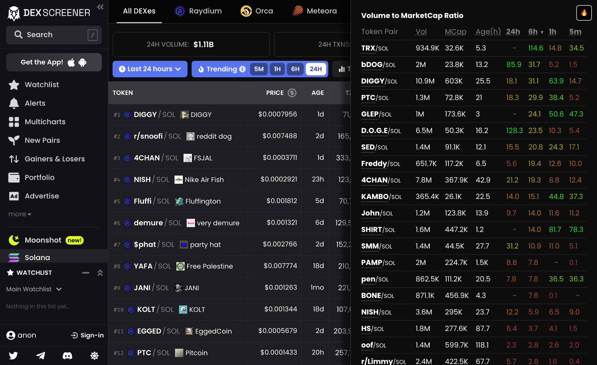

# Volume to MarketCap Ratio (DexScreener)

Chrome extension to add instant insights on market liquidity with volume to market cap ratio data on DexScreener token pairs.

## Installing Instructions

- Download the extension.
- Navigate to `chrome://extensions/` on a chromium based web browser.
- Look for the "Developer Mode" option & activate it.
- Click the "Load unpacked" option.
- Select the folder containing the extension files.

